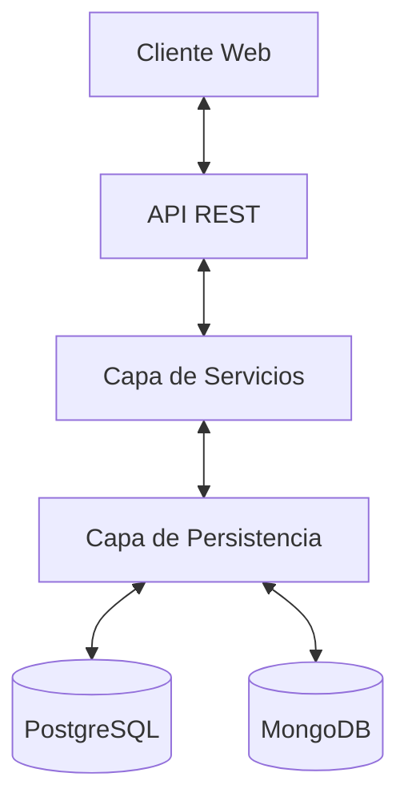
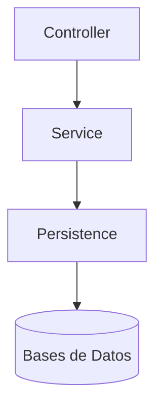
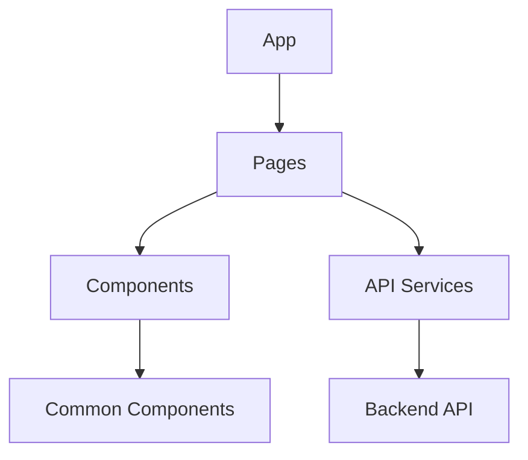
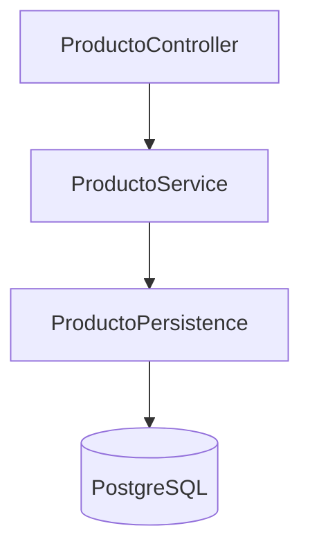
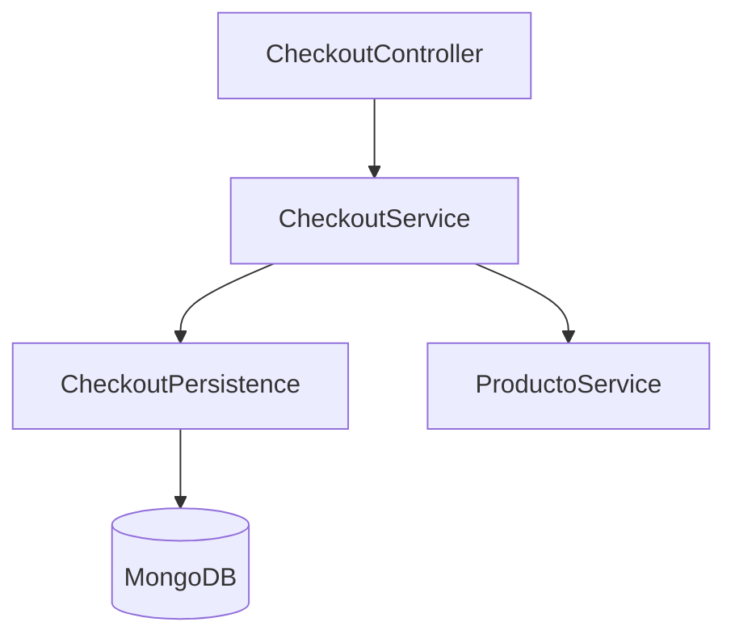
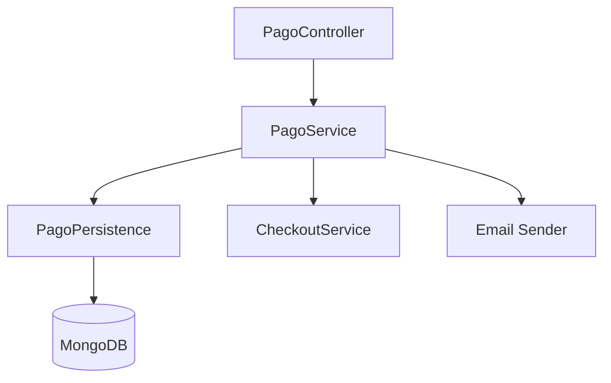

# Patrones del Sistema - Infinia Sports

## Arquitectura del Sistema

### Arquitectura General
El sistema sigue una arquitectura de aplicación web moderna con separación clara entre frontend y backend:

### Backend (Java 17)
El backend implementa una arquitectura de 3 capas bien definida:

1. **Capa de Controller**: Gestiona las peticiones HTTP y respuestas, implementa endpoints REST.
2. **Capa de Service**: Contiene la lógica de negocio y validaciones.
3. **Capa de Persistence**: Gestiona el acceso a datos y operaciones con las bases de datos.

### Frontend (React.js)
El frontend sigue una arquitectura de componentes con separación de responsabilidades:

## Decisiones Técnicas Clave

### Persistencia Dual
- **PostgreSQL**: Utilizado para datos estructurados (Productos) que requieren consultas complejas y relaciones.
- **MongoDB**: Utilizado para datos con estructura variable y compleja (Pedidos) que se benefician del formato JSON.

### Arquitectura de 3 Capas
Implementación estricta de la separación de responsabilidades:
- Controllers solo gestionan peticiones/respuestas HTTP
- Services contienen toda la lógica de negocio
- Persistence se encarga exclusivamente del acceso a datos

### Documentación API con OpenAPI
Uso de OpenAPI 3.0.x para documentar todos los endpoints, facilitando:
- Pruebas de API
- Generación de clientes
- Documentación interactiva

## Patrones de Diseño en Uso

### Patrón Repository
Implementado en la capa de persistencia para abstraer el acceso a datos.

### Patrón Service
Encapsula la lógica de negocio y orquesta operaciones complejas.

### Patrón DTO (Data Transfer Object)
Utilizado para transferir datos entre capas y hacia/desde el cliente.

### Patrón Factory (potencial)
Para la creación de objetos complejos como pedidos.

## Relaciones entre Componentes

### Módulo de Productos

### Módulo de Checkout

### Módulo de Pagos

## Consideraciones de Arquitectura
- Separación clara de responsabilidades
- Minimización de dependencias entre módulos
- Interfaces bien definidas entre capas
- Manejo consistente de errores
- Validaciones en la capa de servicio
